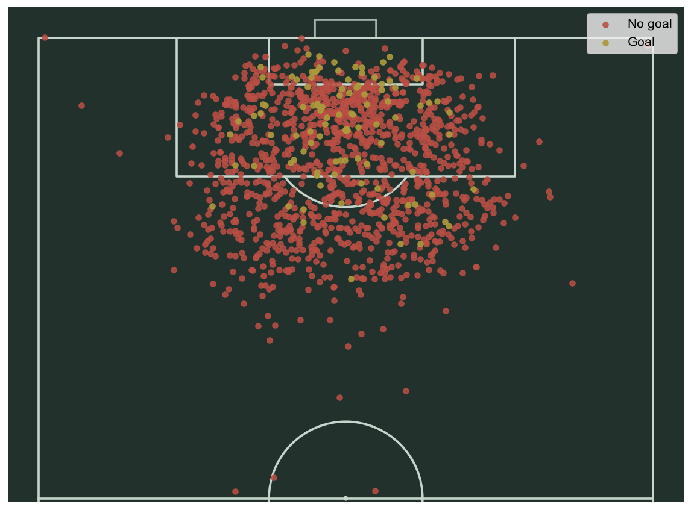
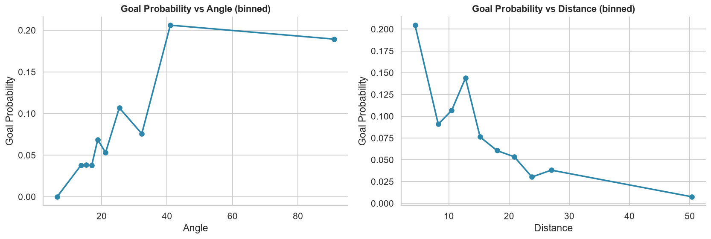
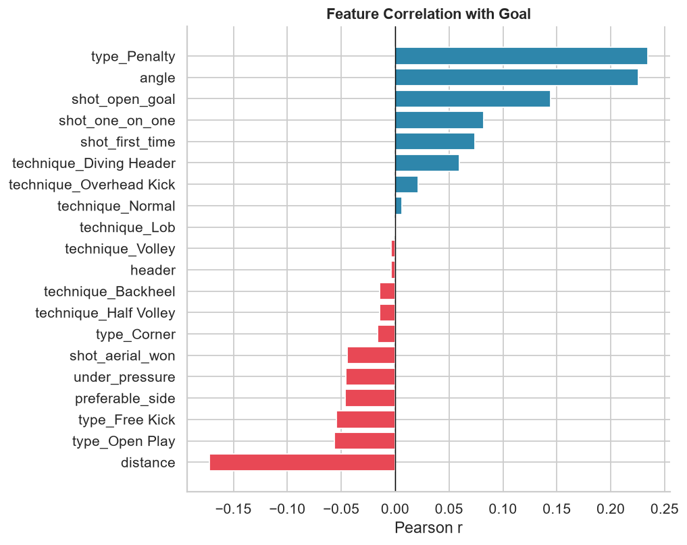
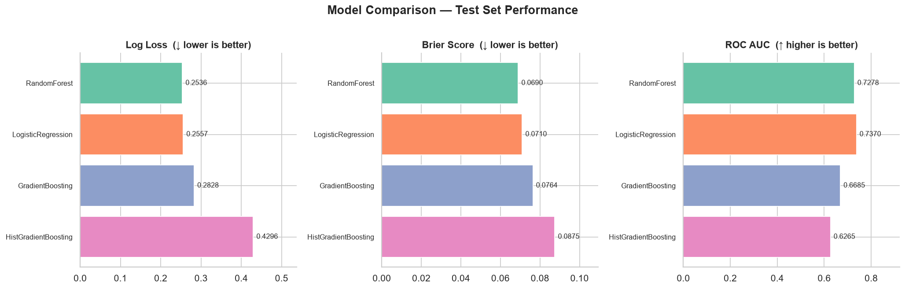
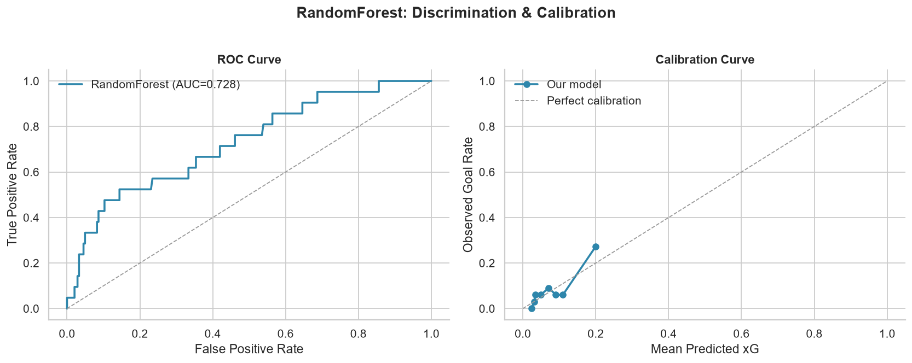
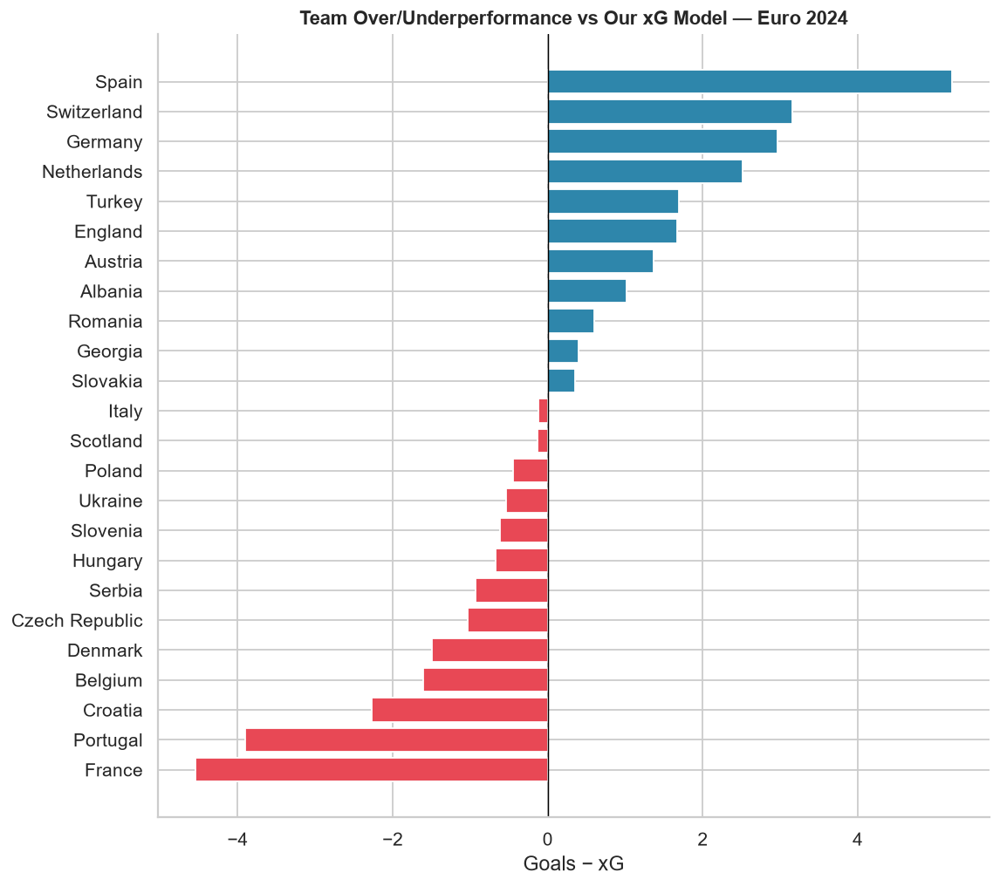
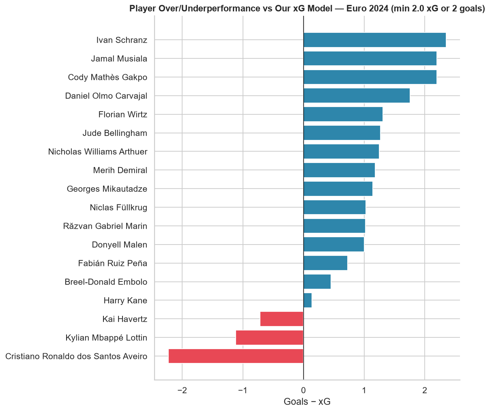
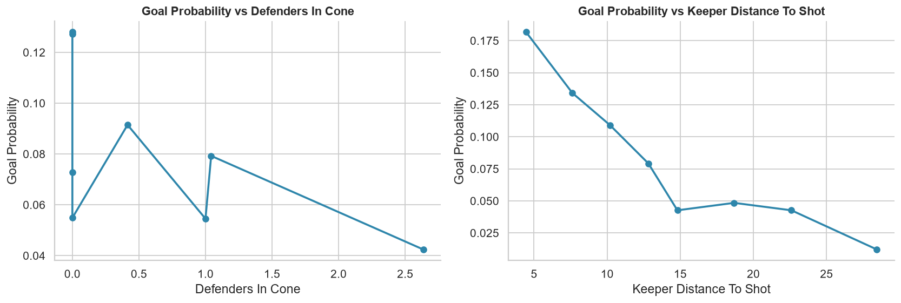
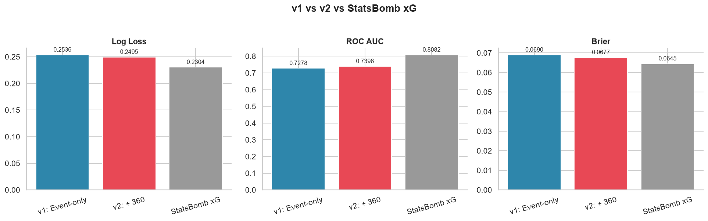
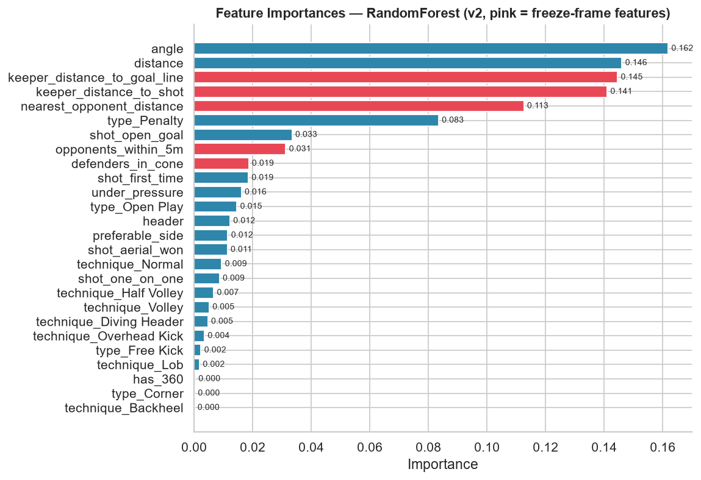

# Euro 2024 Expected Goals (xG) Model


Building an expected goals model from scratch, using StatsBomb's free open shot event
data for **UEFA Euro 2024**, and checking it against StatsBomb's own published xG for
the same shots.

Methodology follows [Alfian Hakim's "How to Build Your Own Expected Goals (xG) Model"](https://medium.com/@alf.19x/how-to-build-your-own-expected-goals-xg-model-2bd186dccdf7)
(which used World Cup 2022 data) — same geometric-feature approach, applied instead to
a full European Championship, then extended further with 360 freeze-frame data.

## Contents

- [Background](#background)
- [Data](#data)
- [Feature Engineering](#feature-engineering)
- [Modelling](#modelling)
- [Team Over/Underperformance](#team-overunderperformance)
- [Player Over/Underperformance](#player-overunderperformance)
- [360 Freeze-Frame Upgrade](#360-freeze-frame-upgrade)
- [Limitations](#limitations)
- [Repository Structure](#repository-structure)
- [Usage](#usage)
- [Key Findings](#key-findings)
- [License & Attribution](#license--attribution)

## Background

xG measures the quality of a chance rather than just counting shots: it's the
probability, between 0 and 1, that a given shot results in a goal, estimated from
thousands of historically similar shots. A tap-in from two yards might carry an xG of
0.8; a speculative strike from 30 yards might be 0.02. Every analytics provider
(StatsBomb, Opta, FBref) runs its own model trained on its own data and features, which
is why the same shot gets a different xG number depending on where you look — there's
no single "correct" xG, only models of varying sophistication. This project builds one
from first principles to see how far a handful of geometric and contextual features get
you toward matching a commercial model's output.

## Data

1,316 shots from all 51 Euro 2024 matches, pulled directly from StatsBomb's free
[open-data](https://github.com/statsbomb/open-data) repository
(`competition_id=55`, `season_id=282`) via `src/fetch_data.py` — no API key needed.

| Outcome | Count |
|---|---|
| Off Target | 397 |
| Blocked | 386 |
| Saved | 312 |
| **Goal** | **107** |
| Wayward | 81 |
| Post / Saved to Post / Saved Off Target | 33 |

Only an **8.1% conversion rate** — goals are the minority class by a wide margin, which
is why evaluation leans on log loss / Brier score / ROC-AUC rather than accuracy.



## Feature Engineering

Raw `(x, y)` shot locations aren't useful to a model directly — they need to become
geometry:

- **Angle** — the angle subtended by the goal mouth from the shot location (wide angle
  = clean sight of a big target)
- **Distance** — distance to the nearest point on the goal line

```python
def calculate_angle(x, y):
    g0 = np.array([120, 44]) - np.array([x, y])
    g1 = np.array([120, 36]) - np.array([x, y])
    angle = np.arctan2(np.linalg.det([g0, g1]), np.dot(g0, g1))
    return abs(np.degrees(angle))
```

Binning shots by angle and distance and plotting the observed goal rate per bin
confirms the intuition immediately — wider angle and shorter distance both push
scoring probability up, though not perfectly monotonically (defenders, keeper
positioning, and shot technique all add noise geometry alone can't capture):



On top of geometry, shot context is added as boolean and one-hot features: body part
(header vs. foot), "preferable side" (does the shooting foot match a finesse angle for
that side of the box), shot technique, shot type (open play / free kick / penalty /
corner), and situational flags (first-time, one-on-one, open goal, aerial ball won,
under pressure).

Correlating every feature against the goal outcome shows what actually predicts
scoring in this dataset:



Penalties (`type_Penalty`) and `angle` are the two strongest positive predictors;
`distance` is by far the strongest negative one — exactly what the geometric model
above predicts. Interestingly, `preferable_side` and `header` show almost no
correlation here, which pushes back a little on the intuitive assumption that
finesse-angle shots are meaningfully more clinical at this shot volume.

## Modelling

Four classifiers are trained as scikit-learn Pipelines (`StandardScaler` → classifier),
evaluated with stratified 5-fold cross-validation, and logged to MLflow:

| Model | CV AUC | Test Log Loss | Test ROC AUC | Test Brier |
|-------|--------|----------------|--------------|------------|
| **Random Forest** | **0.766** | **0.254** | **0.728** | **0.069** |
| Logistic Regression | 0.751 | 0.256 | 0.737 | 0.071 |
| Gradient Boosting | 0.732 | 0.283 | 0.669 | 0.076 |
| Hist Gradient Boosting | 0.742 | 0.430 | 0.627 | 0.088 |



Random Forest comes out on top on log loss and Brier score (the metrics that matter
most for a *probability* estimator, as opposed to a classifier that just needs to rank
shots correctly). Logistic Regression is a close second and, being linear/interpretable,
is arguably the more useful model if you want to reason about *why* a shot got its xG
value rather than just trust the number.

### Best Model: Discrimination & Calibration



The calibration curve tracks the diagonal reasonably well at low predicted xG (where
most shots live) and starts to run hot at the high end — the model's highest-confidence
predictions (penalties, open goals) slightly overstate the true goal rate in this
sample, likely just a small-sample effect given how few such shots exist in one
tournament.

### How Does It Compare to StatsBomb's Own xG?

| Metric | Our Model | StatsBomb xG |
|---|---|---|
| Log Loss | 0.254 | **0.230** |
| ROC AUC | 0.728 | **0.808** |
| Brier | 0.069 | **0.065** |

StatsBomb's model wins on every metric, which is expected — their xG is trained on
millions of shots across competitions and, crucially, uses **360 freeze-frame data**
(defender and goalkeeper positions at the moment of the shot) that this v1 model
doesn't use yet. What's notable is *how close* a model built from nine features and
1,316 shots gets to a commercial model with orders of magnitude more data behind it —
geometry alone explains most of what separates a good chance from a bad one. The
[360 Freeze-Frame Upgrade](#360-freeze-frame-upgrade) section below adds that missing
positioning data back in and narrows the gap further.

## Team Over/Underperformance

Summing each team's shot xG across the tournament and comparing it to actual goals
scored separates "created good chances" from "actually took them":



**Spain overperformed the most** (+5.2 — 14 goals from 8.79 xG), consistent with
winning the tournament on the back of clinical finishing from a young, attacking side.
**France underperformed the most** by a wide margin, scoring far fewer goals than their
chance quality suggested — a narrative that matched a lot of the tournament coverage
around their toothless attack despite reaching the semi-finals. Portugal and Croatia
also finished well below their xG, while Switzerland, Germany, and the Netherlands
outperformed theirs.

## Player Over/Underperformance

Same idea, one level down — filtered to players with at least 2.0 total xG *or* at
least 2 goals, so a player who scored their only, low-xG shot of the tournament doesn't
distort the extremes, while still catching low-volume clinical finishers.



**Cristiano Ronaldo was the biggest underperformer at the tournament** — 23 shots,
2.23 xG, **zero goals**, matching the widely-covered narrative of his missed penalty
against Slovenia and a frustrating tournament in front of goal. **Kylian Mbappé** was
close behind (1 goal from 2.12 xG across 24 shots), consistent with a tournament spent
playing through a broken nose. On the other end, **Ivan Schranz** (Slovakia) was the
standout overperformer — just 5 shots and 0.65 xG produced 3 goals — with **Jamal
Musiala** and **Cody Gakpo** right behind him, both roughly tripling their expected
output from a modest shot count. It's a useful sanity check on the model too: the
players it flags as most over/underperforming are exactly the storylines that defined
the tournament.

## 360 Freeze-Frame Upgrade

Everything above uses only the shot event itself — no idea what the rest of the pitch
looked like at the moment of the shot. That's the biggest reason StatsBomb's own xG
beats ours. **StatsBomb 360 data** fixes that: it captures every visible player's
position (teammate, opponent, goalkeeper — no identity) at the moment of the shot.
Available for 97.3% of shots in this dataset (`src/fetch_360.py`), it's used to
engineer five new features:

| Feature | What it captures |
|---|---|
| `defenders_in_cone` | Opponents standing inside the triangle between the shooter and the two goalposts |
| `nearest_opponent_distance` | Distance to the closest defending outfield player |
| `opponents_within_5m` | Count of defenders crowding the shooter |
| `keeper_distance_to_shot` | How far the goalkeeper is from the shot location |
| `keeper_distance_to_goal_line` | How far off their line the goalkeeper has come |

Shots without 360 coverage get median-imputed values plus a `has_360` flag, so they
don't get dropped or mislead the model.



Retraining the same four classifiers on the expanded feature set:

| Model | CV AUC | Test Log Loss | Test ROC AUC | Test Brier |
|-------|--------|----------------|--------------|------------|
| **Random Forest** | **0.7612** | **0.2495** | **0.7398** | **0.0677** |
| Logistic Regression | 0.7554 | 0.2616 | 0.7262 | 0.0691 |
| Gradient Boosting | 0.7128 | 0.2811 | 0.6802 | 0.0753 |
| Hist Gradient Boosting | 0.6972 | 0.4062 | 0.6618 | 0.0750 |



Random Forest again comes out on top, and it *improves on every metric* over the v1,
event-only model (log loss 0.2536 → 0.2495, ROC-AUC 0.7278 → 0.7398, Brier 0.0690 →
0.0677) — meaningfully closing the gap to StatsBomb's own xG (0.2304 / 0.8082 / 0.0645)
without changing anything about the underlying shots, just adding better context.



`keeper_distance_to_goal_line` and `keeper_distance_to_shot` land right behind `angle`
and `distance` as the 3rd and 4th most important features overall, with
`nearest_opponent_distance` close behind in 5th — goalkeeper positioning turns out to
matter more here than the number of outfield defenders in the shot cone. That tracks:
a keeper who has come off their line changes a shot's quality more dramatically than
one extra defender standing nearby. The remaining gap to StatsBomb is mostly down to
training data volume: their model learns from millions of shots across many
competitions, this one from 1,316 shots in a single tournament.

## Limitations

- **Small sample, single tournament.** 1,316 shots is enough to see clear signal, but
  not enough to fully trust probability estimates in the tails (e.g. very high or very
  low xG bins have few shots backing them up).
- **No hyperparameter tuning.** All models use reasonable fixed defaults
  (`n_estimators`, `max_depth`, `learning_rate`), not a tuned search — a grid/random
  search would likely close some of the remaining gap to StatsBomb.
- **97.3% 360 coverage, not 100%.** The missing 2.7% get median-imputed freeze-frame
  features rather than real positioning data.
- **No assist/pass context.** Whether a shot came from a through ball, a cutback, or a
  long cross isn't modelled — StatsBomb records this as separate pass events that
  aren't joined in here.
- **Single-season model.** Trained and evaluated only on Euro 2024; conclusions about
  feature importance may not generalize cleanly to club football or other tournaments.

## Repository Structure

```
├── data/
│   ├── euro2024_shots.csv
│   └── euro2024_shots_360.csv
├── notebooks/
│   └── euro2024_xg_model.ipynb
├── src/
│   ├── fetch_data.py
│   ├── fetch_360.py
│   ├── data_preprocessing.py
│   ├── models.py
│   ├── train.py
│   ├── train_360.py
│   └── predict.py
├── outputs/
├── models/
└── requirements.txt
```

## Usage

```bash
pip install -r requirements.txt

# v1: event-only model
python src/fetch_data.py                          # cache shot data to data/euro2024_shots.csv
python src/train.py                                # train + log models, save the best one
python src/predict.py --input data/new_shots.csv   # score new shots

# v2: + 360 freeze-frame features
python src/fetch_360.py                            # cache shot + freeze-frame data
python src/train_360.py                            # train + log v2 models, save the best one
```

## Key Findings

- **Angle and distance dominate** as predictors — the pure geometry of a chance
  explains most of its quality, exactly as the underlying physics of shooting suggests.
- **Shot type matters a lot**: penalties carry a much higher baseline scoring
  probability than any open-play feature combination can replicate, which is why
  `type_Penalty` is the single strongest correlate with scoring.
- A from-scratch model trained on ~1,300 shots tracks a commercial provider's
  proprietary xG reasonably closely on log loss and calibration, despite using far
  fewer features.
- **Adding StatsBomb 360 freeze-frame data closes a real chunk of that gap** — five
  defender/goalkeeper positioning features improve the best model on every metric
  (log loss 0.2536 → 0.2495, ROC-AUC 0.7278 → 0.7398) without touching the underlying
  data. Goalkeeper positioning (`keeper_distance_to_goal_line`, `keeper_distance_to_shot`)
  turns out to matter more than the raw count of defenders in the shot cone.
- **Team and player over/underperformance vs. xG** is a useful lens independent of shot
  volume — it separates who created chances from who actually converted them, and lines
  up with the eye-test from the tournament (Spain clinical, France wasteful; Ronaldo and
  Mbappé badly off the pace, Schranz and Musiala clinical).

## Tech Stack

`Python` `scikit-learn` `pandas` `numpy` `MLflow` `matplotlib` `seaborn` `mplsoccer`

## License & Attribution

The code in this repository (`src/`, `notebooks/`) is licensed under the [MIT License](LICENSE).

The **data** (`data/euro2024_shots.csv`, `data/euro2024_shots_360.csv`) is not covered
by that license — it's derived from
[StatsBomb's free open data](https://github.com/statsbomb/open-data), used under their
published Terms & Conditions:

> If you publish, share or distribute any research, analysis or insights based on this
> data, please state the data source as StatsBomb and use our logo, available in their
> [Media Pack](https://statsbomb.com/media-pack/).

**Data provided by StatsBomb.**

Pitch visualizations use [mplsoccer](https://github.com/andrewRowlinson/mplsoccer)
(MIT License). Methodology is adapted from Alfian Hakim's
[xG modelling write-up](https://medium.com/@alf.19x/how-to-build-your-own-expected-goals-xg-model-2bd186dccdf7),
applied here to a different competition, dataset, and modelling setup.
